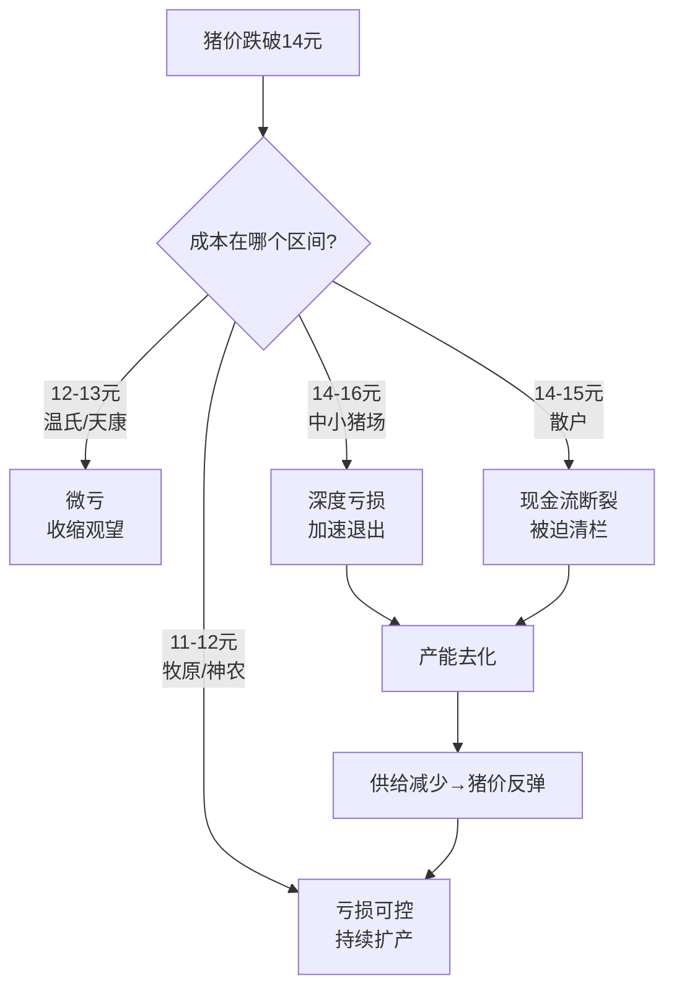

# 中国养猪企业全景对比 & 成本拆分逻辑

> 数据时点：2025-2026年  
> 来源：企业财报、投资者交流记录、行业调研、券商研报

---

## 一、中国上市养猪企业完整一览（2025年出栏 + 最新成本）

### A. 上市猪企完整梯队表（17家）

| 排名 | 企业 | 代码 | 2025年出栏（万头） | 完全成本（元/kg） | PSY（头） | 模式 |
|:---:|------|:---:|:---:|:---:|:---:|------|
| 1 | **牧原股份** | **002714** | **7,798** | **~11.5** | **28.3** | 自繁自养全产业链 |
| 2 | 温氏股份 | 300498 | 4,048 | ~12.0-12.4 | ~26 | 公司+农户 |
| 3 | 新希望 | 000876 | 1,755 | ~13.0 | ~26.3 | 饲料+养殖 |
| 4 | 正邦科技 | 002157 | 854 | ~13.3 | — | 双胞胎重整恢复 |
| 5 | 天邦食品 | 002124 | 666 | ~13.0+ | — | 产能整合中 |
| 6 | 海大集团 | 002311 | 650 | — | — | 饲料+轻资产养殖 |
| 7 | 扬翔股份 | 002988 | 589 | — | ~28-29（历史） | 智能楼房养猪 |
| 8 | 新五丰 | 600975 | 542 | ~14.7-15.3→降 15%+ | — | 国企，降本进行中 |
| 9 | 唐人神 | 002567 | 533 | ~13.0 | — | — |
| 10 | 巨星农牧 | 603477 | 458 | ~13.0（6.5元/斤） | **29-30+** | AI智能养殖 |
| 11 | 大北农 | 002385 | 450 | ~12.0-12.9 | — | 控股+参股 |
| 12 | 京基智农 | 000048 | 400+ | ~13.3（6.65元/斤） | — | 规模较小 |
| 13 | 神农集团 | 605296 | 307 | **~12.1**（6.05元/斤） | **~29.5** | 自繁自养，本地粮源 |
| 14 | 天康生物 | 002100 | 319 | ~12.3（6.15元/斤） | — | 产业链协同 |
| 15 | 东瑞股份 | 001201 | 300+ | — | — | 供港猪 |
| 16 | 立华股份 | 300761 | 280+ | ~11.5（5.75元/斤） | — | 黄羽鸡为主+猪 |
| 17 | 傲农生物 | 603363 | 250+ | ~12.8 | — | — |

### B. 非养殖上市头部猪企（补充参考）

| 企业 | 2024年出栏（万头） | 完全成本（元/kg） | 备注 |
|------|:---:|:---:|------|
| 双胞胎集团 | 1,778 | ~12.5 | 非上市，控股正邦 |
| 正大集团（中国） | 1,200+ | — | 外资龙头 |
| 德康农牧 | 878 | ~12.0-12.5 | 非上市区域龙头 |

### C. 行业尾部

| 类型     | 规模      | 完全成本（元/kg） |  PSY（头）   |
| ------ | ------- | :--------: | :-------: |
| 中小规模猪场 | 几万~几十万头 | **14-16**  | **18-22** |
| 散户     | <500头   | **14-15**  | **17-20** |

> [!NOTE]
> - 立华股份成本数据（5.75元/斤≈11.5元/kg）非常突出，但其猪业规模小（280万头），需关注口径差异
> - 巨星农牧PSY标杆场达33头，是全行业公开数据中最高的
> - 神农集团规模仅307万头但成本仅12.1元，证明"低成本≠大规模"
> - 新五丰成本偏高（~14-15元），但2025年同比降幅超15%，仍在改善中
> - 成本单位注意：行业常用"元/斤"，换算为元/kg需×2

---

## 二、成本梯队可视化

```
完全成本（元/kg）
│
│  11.5 ████████████████████████████████████████████████ 牧原
│  12.0 ██████████████████████████████████████████████████████ 温氏/神农/德康
│  12.5 █████████████████████████████████████████████████████████████ 天康/双胞胎
│  13.0 ████████████████████████████████████████████████████████████████████ 新希望/巨星/唐人神
│  13.3 ██████████████████████████████████████████████████████████████████████ 京基智农
│  --------全行业平均盈亏平衡线（猪价~14.5元时）--------
│  14-16 ████████████████████████████████████████████████████████████████████████████████ 中小猪场
│
│  当前猪价 ≈ 9.5 元/kg → ← 全行业深度亏损
```

> [!CAUTION]
> 当前猪价（~9.5元/kg）远低于所有企业的完全成本。即使牧原也在亏损（每头亏约230元），中小猪场每头亏损超500元。

---

## 三、PSY对比（2025年数据）

| 梯队 | 企业 | PSY | 评价 |
|------|------|:---:|------|
| **顶尖** | 巨星农牧 | 29-30+（标杆场33） | 行业最高 |
| **顶尖** | 神农集团 | ~29.5 | 第一梯队 |
| **优秀** | 牧原股份 | 28.3 | 从2024年26.7快速提升 |
| 良好 | 温氏股份 | ~26 | 从2024年23.7恢复 |
| 良好 | 新希望 | ~26.3 | 稳步改善 |
| **全国平均** | — | ~24.0-24.5 | 微猪科技/数聚专嘉监测 |
| **中小猪场** | — | 20-22 | 数聚专嘉按规模分层数据（详见下方来源说明） |
| **散户** | — | 18-20 | USDA估算+行业倒推（详见下方来源说明） |

> [!IMPORTANT]
> PSY从18→28意味着：**同样数量的母猪，产出仔猪数增加了56%**。这是"能繁母猪存栏下降但供给不减"的核心原因。

**PSY数据来源说明**：

> [!NOTE]
> **农业农村部不直接发布PSY统计**。PSY属于微观生产管理指标，官方发布的是能繁母猪存栏、生猪出栏等宏观数据。市场上的PSY数据主要来自以下渠道：

| 数据层级 | 数值 | 来源 | 说明 |
|----------|:---:|------|------|
| **全国平均PSY** | **~24.0头**（2024） | 微猪科技《2024猪业数据年报》 | 基于其数字化管理系统覆盖猪场的监测数据 |
| **全国平均PSY** | **~24.5头**（2025） | 《2025数聚专嘉中国猪场PSY白皮书》（嘉吉） | 覆盖超300万头母猪样本 |
| **农业农村部监测口径** | **刚超过23头**（2025） | 数聚专嘉白皮书引用农业农村部数据 | 官方口径偏保守，含大量低效场 |
| **规模场（>1000头母猪）** | ~25-26头 | 数聚专嘉白皮书按规模分层 | 规模场与中小场PSY差距约2.5头（2025年） |
| **中小场（<300头母猪）** | ~22-23头 | 数聚专嘉白皮书按规模分层 | 使用数字化工具的中小场，未使用的更低 |
| **低效场/散户** | ~18-20头 | USDA FAS估算 + 行业倒推 | USDA估算2024年全国均值仅21头（含大量散户拉低） |
| **头部上市企业** | 26-30+头 | 各公司投资者交流记录 | 详见第六节各公司验证源头 |
| **Top 10标杆场** | **33.3头** | 数聚专嘉白皮书 | 行业天花板水平 |

> **关键逻辑**：全国平均PSY约24头，但头部上市企业PSY 26-30+，意味着**非头部企业（中小场+散户）的PSY必然显著低于24头**才能拉出这个加权平均值。考虑到头部10家企业出栏占比约25%，倒推非头部企业PSY约为 `(24×100 - 28×25) ÷ 75 ≈ 22.7头`，与数聚专嘉分层数据（中小场22-23头）吻合。散户中管理最粗放的群体PSY在18-20头。

---

## 四、为什么要拆分成本差距？——归因分析的核心逻辑

你在 [中小猪场与牧原成本差距归因分析.md](file:///Users/huangliyi/ai_chat/stock/10_猪周期与牧原/中小猪场与牧原成本差距归因分析.md) 中做的拆分，核心目的是回答一个关键投资问题：

> **中小猪场的成本劣势，到底是因为"规模不够大"，还是因为"管理技术不行"？**

这个问题的答案，直接决定了你对猪周期演变的判断：

### 场景A：如果成本差距主要来自"规模"
→ 那么随着行业集中度提升，中小场的成本会自然下降  
→ 行业整体成本线会下移  
→ 猪价中枢会长期下压  
→ **牧原的成本护城河会被侵蚀**

### 场景B：如果成本差距主要来自"管理+技术+硬件"
→ 那么即使中小场扩大规模，成本也降不下来  
→ 牧原的优势是**结构性的**，不会因行业集中度提升而缩小  
→ 在周期底部，中小场会被持续淘汰  
→ **牧原的成本护城河是深且持久的**

### 拆分后的结论

文档通过定量计算得出：

```
中小猪场落后牧原 2.5-4.5 元/kg 的成本差距中：

┌─────────────────────────────────────────────────┐
│  "规模大小"导致的：仅约 20-25%（~0.5-1.0元）      │
│   → 饲料集采议价权 + 固定费用摊薄                   │
│                                                     │
│  "管理+技术+硬件"导致的：约 75-80%（~1.5-3.5元）   │
│   → PSY差距 + 死淘率 + 料肉比 + 人工效率            │
└─────────────────────────────────────────────────┘
```

### 各因素拆分明细

| 因素 | 成本差距贡献 | 归因类别 | 计算逻辑 |
|------|:---:|------|------|
| **PSY差距** | ~0.75元/kg | 管理+技术 | 母猪年成本6000元：(6000/20 - 6000/28) ÷ 115kg |
| **饲料采购溢价** | ~0.75元/kg | **规模** | 商品料比自配料贵200-400元/吨 × 0.3吨/头 ÷ 115kg |
| **死淘率分摊** | ~0.75元/kg | 管理+硬件 | 牧原5% vs 中小场10-15%，死猪成本由活猪分摊 |
| **料肉比+人效** | ~0.50元/kg | 管理+技术 | 料肉比每差0.1 → 成本差~0.34元/kg |
| **合计** | **~2.75元/kg** | — | 11.5 + 2.75 = 14.25，落入14-16区间 ✓ |

> [!TIP]
> 交叉验证：牧原11.5 + 拆分差距2.75 = **14.25元/kg**，恰好落在中小猪场的14-16元实际成本区间内，说明拆分量级合理。

---

## 五、拆分的投资含义

### 1. 牧原的护城河是"管理能力"，不是"规模大小"

新希望出栏1,652万头（温氏3,018万头），规模不小，但成本仍比牧原高1-1.5元/kg。规模不能自动带来低成本。

### 2. 中小猪场不会因为"抱团做大"就变得有竞争力

75-80%的成本差距来自PSY、死淘率、料肉比等管理技术指标——这些需要：
- 多年育种积累（种猪质量）
- 全封闭猪舍+空气过滤（硬件投资）
- 数字化精细管理体系
- 专业化团队执行力

### 3. 周期底部的淘汰是"管理差的"先死，不是"规模小的"先死



### 4. 对未来猪价中枢的判断

由于成本差距主要是管理驱动（而非规模驱动），行业集中度提升不会显著拉低成本线。**猪价的长期中枢取决于行业边际成本（中小场的14-15元），而非龙头成本（牧原的11.5元）**。

> [!IMPORTANT]
> 这就是拆分的核心价值：**它证明了牧原的3元/kg成本优势是结构性的、可持久的**，从而支撑了"牧原在周期底部是安全边际最高的标的"这一投资论点。

---

## 六、数据源与验证指南（17家企业全覆盖）

为了确保数据的准确性，你可以在上市公司官方信息披露渠道（如巨潮资讯网）或直接点击下方链接，通过以下确切的源头报告来核对各指标数据：

> **出栏量统一说明**：所有上市企业的出栏量数据，全部出自各家于2026年1月初发布的**《2025年12月份生猪（肉猪）销售情况简报》**。下面不再对出栏量一一赘述，重点列出**完全成本**和**PSY**的来源。

### 1. 行业龙头（第一、二梯队）
*   **牧原股份 (002714)**
    *   **链接**：[牧原公告主页](https://data.eastmoney.com/notices/stock/002714.html)
    *   **验证源头**：[2026年4月30日投资者关系活动记录表.pdf](https://static.cninfo.com.cn/finalpage/2026-04-30/1225269383.PDF)、[2025年5月30日投资者交流记录.pdf](https://static.cninfo.com.cn/finalpage/2025-05-30/1223723554.PDF)
    *   **核对点**：26年目标11.5元，PSY达28.3，全程成活率约83%。
*   **温氏股份 (300498)**
    *   **链接**：[温氏公告主页](https://data.eastmoney.com/notices/stock/300498.html)
    *   **验证源头**：《2026年第一季度业绩说明会/投资者关系活动记录表》、《2025年1月6日投资者交流》
    *   **核对点**：猪业综合成本控制在12-12.4元区间，PSY恢复至约26头。
*   **新希望 (000876)**
    *   **链接**：[新希望公告主页](https://data.eastmoney.com/notices/stock/000876.html)
    *   **验证源头**：《2026年1月30日投资者关系活动记录表》（分析师会议）、《2025年11月11日投资者交流》
    *   **核对点**：正常运营场线PSY达到26.3，12月完全成本降至12.2元/kg（全年均值约13.0）。
*   **正邦科技 (002157)**
    *   **链接**：[正邦公告主页](https://data.eastmoney.com/notices/stock/002157.html)
    *   **验证源头**：双胞胎集团重整汇报、近期生产经营交流公告及2025年经营快报
    *   **核对点**：重整后出栏量恢复，育肥成本约13.3元/kg。
*   **天邦食品 (002124)**
    *   **链接**：[天邦公告主页](https://data.eastmoney.com/notices/stock/002124.html)
    *   **验证源头**：公司互动易回复及2025年年度报告预告
    *   **核对点**：经营承压、重组期间成本维持在13.0+水平。
*   **海大集团 (002311)**
    *   **链接**：[海大公告主页](https://data.eastmoney.com/notices/stock/002311.html)
    *   **验证源头**：《2025年年度报告》
    *   **核对点**：饲料业务为主，生猪养殖采取“外购仔猪+公司+家庭农场”轻资产运营模式。

### 2. 成本优秀梯队
*   **神农集团 (605296)**
    *   **链接**：[神农公告主页](https://data.eastmoney.com/notices/stock/605296.html)
    *   **验证源头**：《2025年年度报告》、2026年一季度机构调研记录
    *   **核对点**：商品猪完全成本控制在6.05元/斤（~12.1元/kg），PSY达29.5头。
*   **巨星农牧 (603477)**
    *   **链接**：[巨星公告主页](https://data.eastmoney.com/notices/stock/603477.html)
    *   **验证源头**：《2026年1月及4月投资者关系活动记录表》
    *   **核对点**：高繁系母猪PSY突破30，25年底肥猪完全成本控制在6.0元/斤以内（全年约6.5元/斤即13.0元/kg）。
*   **天康生物 (002100)**
    *   **链接**：[天康公告主页](https://data.eastmoney.com/notices/stock/002100.html)
    *   **验证源头**：《2026年4月-5月投资者关系活动记录表》
    *   **核对点**：截至2025年12月生猪养殖完全成本为12.37元/公斤（合6.15元/斤）。
*   **立华股份 (300761)**
    *   **链接**：[立华公告主页](https://data.eastmoney.com/notices/stock/300761.html)
    *   **验证源头**：《2026年一季度报告及业绩交流会记录》
    *   **核对点**：部分优秀场线肥猪完全成本压降至5.75元/斤（~11.5元/kg）。

### 3. 其他重点企业
*   **大北农 (002385)**
    *   **链接**：[大北农公告主页](https://data.eastmoney.com/notices/stock/002385.html)
    *   **验证源头**：《2025年半年度/年度调研纪要》
    *   **核对点**：控股+参股模式，上半年完全成本约12.7元/kg，东北平台约12.1元/kg，年末降至12.0-12.9元/kg。
*   **京基智农 (000048)**
    *   **链接**：[京基公告主页](https://data.eastmoney.com/notices/stock/000048.html)
    *   **验证源头**：《2025年中期及三季度业务发展电话会议纪要》
    *   **核对点**：前三季度成本约13.4元/kg，26年目标12元/kg。
*   **新五丰 (600975)**
    *   **链接**：[新五丰公告主页](https://data.eastmoney.com/notices/stock/600975.html)
    *   **验证源头**：《2025年年度报告》
    *   **核对点**：未披露绝对值，但年报明确“养殖综合成本同比下降超过15%”（券商倒推14.7-15.3元/kg）。
*   **唐人神 (002567)**
    *   **链接**：[唐人神公告主页](https://data.eastmoney.com/notices/stock/002567.html)
    *   **验证源头**：《2025年年度报告》及互动易平台回复
    *   **核对点**：通过精细化管理和降本控费应对周期，成本约13.0元/kg。
*   **东瑞股份 (001201)**
    *   **链接**：[东瑞公告主页](https://data.eastmoney.com/notices/stock/001201.html)
    *   **验证源头**：《2025年年度报告》
    *   **核对点**：主要供应香港市场，自繁自养模式。
*   **傲农生物 (603363)**
    *   **链接**：[傲农公告主页](https://data.eastmoney.com/notices/stock/603363.html)
    *   **验证源头**：公司重整进展公告及投资者互动平台回复
    *   **核对点**：2026年一季度出栏完全成本披露为12.83元/kg。
*   **扬翔股份 (002988)**（未上市）
    *   **验证源头**：公司IPO招股说明书（历史数据）
    *   **核对点**：公司主打智能楼房养猪及FPF未来猪场系统，因已撤回上市材料无近期年报，历史PSY数据约为28-29头。

### 4. 中小猪场及散户成本：自下而上完整推算

中小猪场和散户没有定期财报披露义务，因此无法像上市公司那样直接查到"完全成本"。以下通过**多个独立数据源交叉验证**，自下而上推算其完全成本。

---

#### 4.1 锚点一：国家发改委官方监测数据

国家发改委价格监测中心每月发布《全国生猪养殖成本收益情况》，是最权威的散户成本数据源。

| 时间节点 | 散养生猪头均成本（元/头） | 规模养殖头均成本（元/头） | 散养-规模差（元/头） |
|:---:|:---:|:---:|:---:|
| 2024年12月 | **2,264** | 2,123 | +141 |
| 2025年4月 | **2,123** | 2,033 | +90 |
| 2025年6月 | **2,098** | 2,053 | +45 |

> **来源**：国家发改委价格监测中心月报，[大畜牧网整理](https://www.dxumu.com/)、[山东省发改委公示](http://fgw.shandong.gov.cn/)

**折算到元/kg**（按120kg出栏体重）：

| 时间节点 | 散养（元/kg） | 规模（元/kg） |
|:---:|:---:|:---:|
| 2024年12月 | **18.9** | 17.7 |
| 2025年4月 | **17.7** | 16.9 |
| 2025年6月 | **17.5** | 17.1 |

> [!WARNING]
> **发改委口径 ≠ 上市公司口径**。发改委"成本"包含了自有劳动力折价、土地折算、管理费等"机会成本"项，口径偏宽。上市公司的"完全成本"通常不包含这些虚拟项。因此发改委数据的绝对值偏高（17-19元），但**散养与规模的相对差距**（每头多90-141元，约0.75-1.2元/kg）是可信的。

---

#### 4.2 锚点二：自下而上分项推算（自繁自养中小场，按120kg出栏）

| 成本项 | 中小猪场（元/头） | 牧原（元/头） | 差距（元/头） | 数据来源 |
|--------|:---:|:---:|:---:|------|
| **① 饲料** | 1,080-1,200 | 900-950 | +130-250 | 见4.3节饲料推算 |
| **② 仔猪摊销** | 300-400 | 214 | +86-186 | 见4.4节PSY推算 |
| **③ 死淘分摊** | 150-230 | 68 | +82-162 | 见4.5节死淘推算 |
| **④ 人工** | 150-300 | 30-50 | +100-250 | 散户人均管理300-500头 vs 牧原人均管理3,000-5,000头 |
| **⑤ 防疫兽药** | 50-80 | 30-40 | +10-40 | 散户体系不健全，用药多但防效差 |
| **⑥ 折旧水电杂费** | 40-100 | 80-120 | -40~-20 | 散户猪舍简陋折旧低，但牧原规模摊薄 |
| **合计** | **1,770-2,310** | **1,322-1,392** | **+448-918** | — |
| **折合元/kg** | **14.8-19.3** | **11.0-11.6** | **+3.7-7.7** | — |

> **中小猪场合理区间**：扣除发改委口径中的"自有劳动力虚拟折价"等项后（约150-200元/头），中小场的**可比完全成本**约为 **1,600-2,100元/头**，即 **13.3-17.5元/kg**，中值约 **14.5-15.5元/kg**。

---

#### 4.3 饲料成本推算明细

**基础数据源**：[农业农村部畜牧兽医局、全国畜牧总站2026年4月全国畜产品和饲料价格情况](https://www.nahs.org.cn/jcyj/scxs/202605/t20260519_472251.htm)

| 参数 | 牧原 | 中小猪场 | 差距来源 |
|------|:---:|:---:|------|
| 饲料单价（元/kg） | ~3.0-3.1（自配料） | ~3.4-3.6（商品料） | 商品料含厂家利润+经销加价+物流+包装+账期利息 |
| 全程料肉比 | ~2.7 | ~2.8-3.0 | 配方精准度、环控、健康管理 |
| 每头饲料用量（kg） | ~324（120×2.7） | ~336-360（120×2.8~3.0） | — |
| **每头饲料总费用** | **~972-1,004** | **~1,142-1,296** | **+170-292元/头** |

> **商品料 vs 自配料价差验证**：
> - 全国育肥猪配合饲料均价 **3.41元/kg**（农业农村部2026年4月监测）
> - 玉米均价 **2.50元/kg**、豆粕 **3.37元/kg**（同上）
> - 牧原自配料成本：按典型配方（玉米65%+豆粕18%+其他17%），原料成本约 `0.65×2.50 + 0.18×3.37 + 0.17×2.0 ≈ 2.57元/kg`，加加工费0.15元，自配料约 **2.72元/kg**
> - 差价：`3.41 - 2.72 = 0.69元/kg`，折合每吨 **690元**
> - 但牧原还使用**低蛋白日粮技术**进一步降低豆粕用量，实际差距可能更大
> - 考虑到中小场也有部分自配能力，取 **200-400元/吨** 作为加权平均价差是保守估计

---

#### 4.4 仔猪摊销推算明细（PSY驱动）

| 参数 | 牧原 | 中小猪场 | 数据来源 |
|------|:---:|:---:|------|
| PSY | 28.3 | 18-22（取中值20） | 牧原：[2026年4月投资者交流记录](https://static.cninfo.com.cn/finalpage/2026-04-30/1225269383.PDF)；中小场：数聚专嘉白皮书分层数据（<300头母猪场约22-23头）+ USDA估算散户18-20头 |
| 母猪年饲养成本 | ~6,000元 | ~5,500-6,000元 | 饲料+折旧+疫苗+配种等固定开支 |
| 单头仔猪摊销 | `6000÷28=214元` | `6000÷20=300元` | — |
| **差距** | — | — | **+86元/头 → 0.72元/kg** |

> **PSY敏感性分析**：

| 中小场PSY | 单头仔猪摊销（元） | 与牧原差距（元/头） | 折合差距（元/kg） |
|:---:|:---:|:---:|:---:|
| 18 | 333 | 119 | **1.0** |
| 20 | 300 | 86 | **0.7** |
| 22 | 273 | 59 | **0.5** |

---

#### 4.5 死淘率推算明细

| 参数 | 牧原 | 中小猪场 | 数据来源 |
|------|:---:|:---:|------|
| 全程死淘率 | ~5%（全程成活率83%含淘汰母猪等） | ~10-15% | 牧原：公司披露；中小场：行业调研 |
| 死亡猪前期投入（元/头，均值） | ~650（取半程投入） | ~650 | 死亡时间点不同损失不同 |
| 每100头中死淘分摊 | `5×650÷95=34元/头` | `12×650÷88=89元/头`（取12%） | — |
| **差距** | — | — | **+55元/头 → 0.46元/kg** |

> **死淘率敏感性分析**（死亡猪均值投入650元假设）：

| 中小场死淘率 | 每头活猪多摊（元） | 与牧原差距（元/头） | 折合差距（元/kg） |
|:---:|:---:|:---:|:---:|
| 8% | 57 | 23 | **0.19** |
| 10% | 72 | 38 | **0.32** |
| 12% | 89 | 55 | **0.46** |
| 15% | 115 | 81 | **0.67** |

---

#### 4.6 人工效率推算

| 参数 | 牧原 | 中小猪场 | 数据来源 |
|------|:---:|:---:|------|
| 人均管理头数 | 3,000-5,000头/人/年 | 300-500头/人/年 | 牧原智能化系统vs人工巡栏 |
| 平均年薪 | ~8-10万元 | ~5-8万元 | — |
| 人工成本/头 | `90000÷4000=22.5元` | `60000÷400=150元` | — |
| **差距** | — | — | **+127元/头 → 1.06元/kg** |

> 注：散户常忽略自身劳动力成本。从会计核算角度应计入，但实际现金支出可能为0。发改委口径将自有劳动力按市场工资折价计入。

---

#### 4.7 三重交叉验证

| 验证路径 | 散户/中小场完全成本估算 | 可信度 |
|----------|:---:|:---:|
| **路径A：发改委监测** | 17.5-18.9元/kg（含虚拟成本），可比口径约 **14.5-16元** | ⭐⭐⭐⭐ |
| **路径B：自下而上分项加总** | 14.8-19.3元/kg（宽口径），可比口径约 **13.3-17.5元** | ⭐⭐⭐ |
| **路径C：牧原成本+归因差距** | 11.5 + 2.75 = **14.25元/kg** | ⭐⭐⭐ |
| **三者交集** | **14-16元/kg** | — |

> [!TIP]
> **结论**：三条独立路径的结果均落在 **14-16元/kg** 区间内，相互印证。这不是一个精确的点估计，而是一个经过多源验证的**稳健区间**。

---

#### 4.8 全部数据来源汇总

| 数据 | 来源 | 链接/查阅方式 |
|------|------|------|
| 散养/规模成本收益月报 | 国家发改委价格监测中心 | [发改委价格监测](https://jgjc.ndrc.gov.cn/)，搜索"生猪养殖成本收益" |
| 全国饲料均价3.41元/kg | 农业农村部畜牧兽医局 | [2026年4月畜产品饲料价格](https://www.nahs.org.cn/jcyj/scxs/202605/t20260519_472251.htm) |
| 玉米2.50元/kg、豆粕3.37元/kg | 同上 | 同上 |
| 散养户月度成本收益整理 | 大畜牧网 | [dxumu.com](https://www.dxumu.com/) 搜索"发改委 生猪 成本收益" |
| 各省散养成本公示 | 山东省发改委等 | [山东省发改委](http://fgw.shandong.gov.cn/) 搜索"生猪养殖成本" |
| 历年成本收益年鉴 | 《全国农产品成本收益资料汇编》 | 国家统计局出版物，各地图书馆可查 |
| 商品料vs自配料价差 | 行业调研共识 | 多家券商研报及养殖户访谈 |
| 全国平均PSY ~24头（2024-2025） | 微猪科技《2024猪业数据年报》 | [agripost.cn 报道](https://www.agripost.cn/)，搜索"微猪科技 PSY年报" |
| 按规模分层PSY（中小场22-23头） | 《2025数聚专嘉中国猪场PSY白皮书》（嘉吉） | [agripost.cn 报道](https://www.agripost.cn/)，搜索"数聚专嘉 PSY白皮书" |
| 散户PSY ~18-20头 | USDA FAS 估算（2024全国均值21头） | USDA FAS China Livestock Annual Report |
| 中小场料肉比2.8-3.0 | 行业调研共识 | 多家券商研报（华泰、东方财富等） |
| 牧原全部生产指标 | 牧原股份官方披露 | [牧原2026年4月投资者交流记录](https://static.cninfo.com.cn/finalpage/2026-04-30/1225269383.PDF) |

> [!NOTE]
> **查阅建议**：点击上方各公司链接后，进入公告主页。在公告类别中选择 **"投资者关系信息（调研）"**，即可直接阅读官方交流会议纪要和原版 PDF，这是获取成本/PSY最核心的一手数据来源。
> 详细的归因拆分逻辑，可对比阅读 [中小猪场与牧原成本差距归因分析.md](file:///Users/huangliyi/ai_chat/stock/10_猪周期与牧原/中小猪场与牧原成本差距归因分析.md)。
